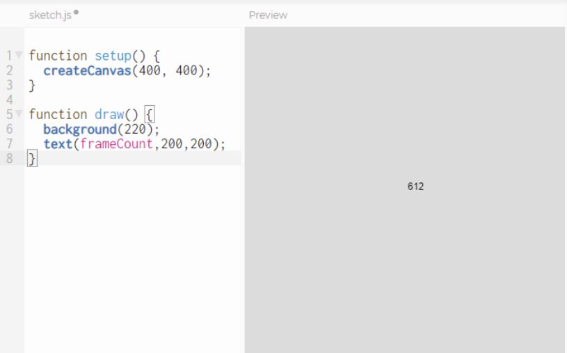
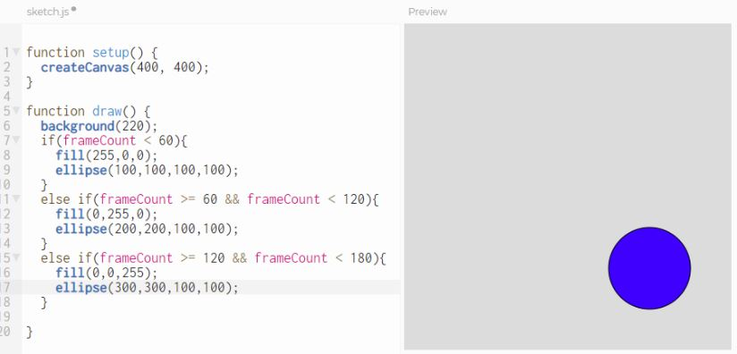
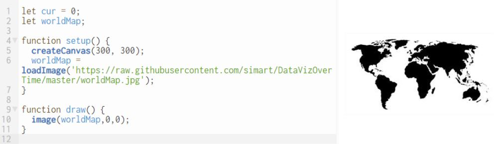
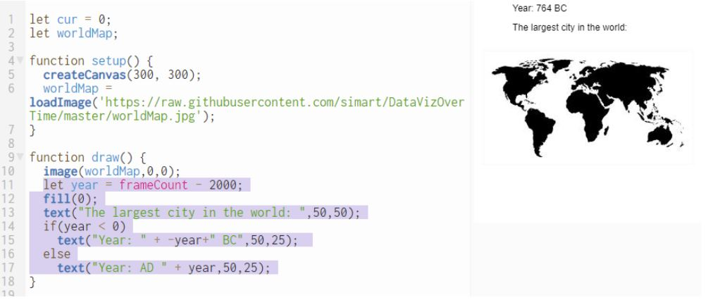
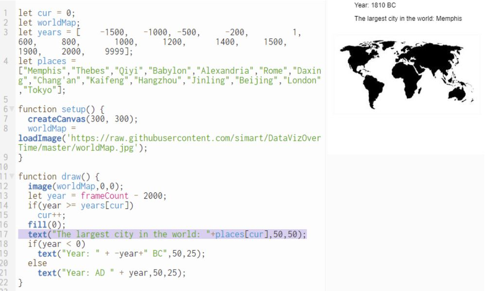
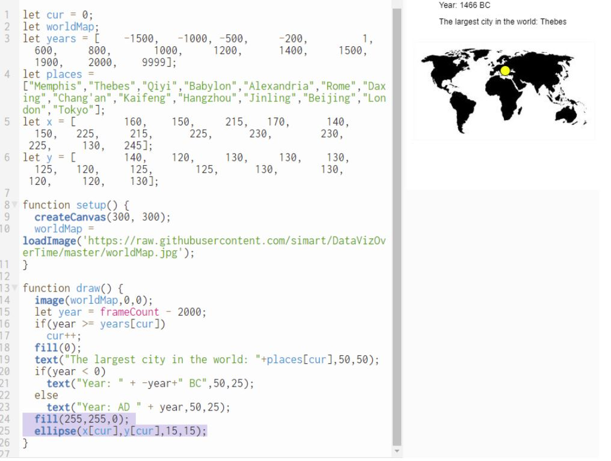

Data Visualization Tutorial: The worlds largest city
=====================================================

First, watch [Hans Rosling's 200 Countries, 200 Years, 4 Minutes](https://www.youtube.com/watch?v=jbkSRLYSojo). It's a data visualization on the statistics of health in 200 differenct countries over the past 200 years.   

This tutorial will take you step by step through the process of creating a similar but simpler data visualization of the largest city in the world over the past 4000 years using P5. Go to [editor.p5js.org](https://editor.p5js.org/) and enter the following code.    
   
The `frameCount` variable keeps track of the number of times the screen is drawn. By default the `draw()` function runs 60 times a second. We can use the `frameCount` variable to make things appear or disappear at different times. Now add the following code to your program and run it. You should see red, green and blue ellipses appear at different times.   
   
So now lets add a map that we can use for the background. Here’s a link to a world map we can use for our visualization: [https://raw.githubusercontent.com/simart/DataVizOverTime/master/worldMap.jpg](). You can use the link to load the picture into your program with code like this:
    
We’ll use `frameCount` to display the year. We’ll use negative numbers for BC and positive for AD.   

Here’s some data from the [Wikipedia article List of largest cities throughout history](https://en.wikipedia.org/wiki/List_of_largest_cities_throughout_history) stored in two arrays `years` and `places`.

`let years = [    -1500,   -1000,   -500,   -200,      1,         600,    800,      1000,     1200,     1400,     1500,     1900,     2000,    9999];`
`let places = ["Memphis","Thebes","Qiyi","Babylon","Alexandria","Rome","Daxing","Chang'an","Kaifeng","Hangzhou","Jinling","Beijing","London","Tokyo"];`
Add that with some other code to your program:   
   
Here’s two more arrays `x` and `y`   
`let x = [        160,    150,     215,     170,       140,      150,   225,     215,      225,      230,       230,       225,     130,      245];`    
`let y = [        140,    120,     130,     130,       130,      125,   120,     125,      125,      130,       130,       120,     120,      130];`   
`x` and `y` hold the x and y coordinates of the city on the world map. We’ll use this data to display a dot in an appropriate place on the map at the right time.
    
Now that you have a working program, feel free to mondify it. Submit the URL of your finished program to Google classroom.

